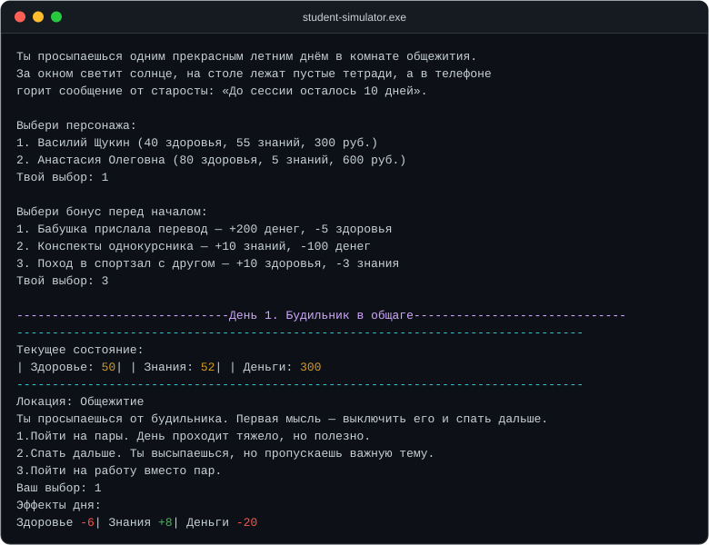

<div align="center">

# student-simulator

**Консольный симулятор студента: 10 дней до сессии, три ресурса, случайные сны и больше десятка концовок.**

[](https://github.com/Ilya0107/student-simulator/actions/workflows/build.yml)


[English version](README.en.md) | **Русский**

</div>



## О проекте

`student-simulator` — текстовая игра в консоли Windows, написанная на **C++17**.
У вас есть **10 дней** до экзамена: нужно распределить время между учёбой,
работой, сном и отдыхом так, чтобы дожить до сессии с приемлемым здоровьем, деньгами
и знаниями. Каждый день — выбор из трёх вариантов, каждый выбор меняет баланс трёх
характеристик. Ночью могут сниться сны, а финал зависит от того, с чем вы подошли к
экзамену — вплоть до бизнеса, профессионального спорта и секретной концовки.

Проект родился на хакатоне и затем был отбалансирован: аккуратно вынесенный контент,
чистая сборка без предупреждений и понятная структура кода.

## Возможности

- **Три шкалы**: здоровье, знания, деньги — ежедневные 20 ₽ расходов и риск уйти в минус.
- **10 дней по 3 уникальных варианта** с разными торговыми офф-сетами характеристик.
- **Случайные сны** с растущим/падающим шансом — дополнительный элемент риска.
- **Разветвлённый финал**: оценки 2–5, подкуп преподавателя, отчисление, смерть,
  уход в бизнес или спорт и секретная концовка.
- **Цветной вывод** и ASCII-арт прямо в консоли.
- **Данные отделены от логики** — контент лежит в таблицах `DAYS`/`DREAMS`, а не в коде.
- **CI** — решение собирается на GitHub Actions на каждый push.

## Управление

- Ввод числа `1`–`3` с клавиатуры и `Enter`.
- Ошибочный ввод не ломает игру: поток ввода очищается и запрос повторяется.
- После сна нужно нажать `Enter`, чтобы продолжить.

Пример игрового процесса:

```text
------------------------------День 1. Будильник в общаге------------------------------
--------------------------------------------------------------------------------
Текущее состояние:
| Здоровье: 50| | Знания: 52| | Деньги: 300
--------------------------------------------------------------------------------
Локация: Общежитие
Ты просыпаешься от будильника. Первая мысль — хочется выключить его и спать дальше.
    1.Пойти на пары. День проходит тяжело, но полезно.
    2.Спать дальше. Ты высыпаешься, но пропускаешь важную тему.
    3.Пойти на работу вместо пар.
Ваш выбор:
```

## Быстрый старт

Требуется **Windows** (используется консольный API Windows) и **Visual Studio 2022**
с рабочей нагрузкой «Разработка классических приложений на C++».

### Visual Studio

1. Откройте `student-simulator.sln`.
2. Выберите конфигурацию `Release` / `x64` и соберите решение (`Ctrl+Shift+B`).
3. Запустите `x64\Release\student-simulator.exe`.

### Командная строка (MSBuild)

```powershell
msbuild student-simulator.sln /p:Configuration=Release /p:Platform=x64
```

### CMake

```powershell
cmake -B build -A x64
cmake --build build --config Release
```

## Структура проекта

```
student-simulator/
├── src/
│   ├── main.cpp          # точка входа, игровой цикл, сны
│   ├── player.h/.cpp     # класс Player, вывод, экзамен и концовки
│   ├── text_data.h/.cpp  # весь контент: дни, сны, тексты, ASCII-арт
│   └── color.h/.cpp      # цвет консоли (обёртка над WinAPI)
├── docs/                 # документация
├── screenshots/          # изображение для README
├── .github/workflows/    # CI-сборка
├── student-simulator.sln
├── CMakeLists.txt
└── LICENSE
```

## Документация

- [`docs/GAMEPLAY.md`](docs/GAMEPLAY.md) — как играть, персонажи, ресурсы, механики.
- [`docs/BALANCE.md`](docs/BALANCE.md) — все эффекты дней, снов, формулы оценок и подкупа.
- [`docs/ENDINGS.md`](docs/ENDINGS.md) — все концовки и условия их получения.
- [`docs/ARCHITECTURE.md`](docs/ARCHITECTURE.md) — архитектура, модули и технические решения.
- [`docs/ROADMAP.md`](docs/ROADMAP.md) — план развития и улучшения архитектуры.

## Технологии

`C++17` · `WinAPI (console)` · `Visual Studio 2022 / MSBuild` · `CMake` · `GitHub Actions`

## Лицензия

Проект распространяется под лицензией **MIT** — см. [`LICENSE`](LICENSE).

## Автор

**Ilya** — [github.com/Ilya0107](https://github.com/Ilya0107)
